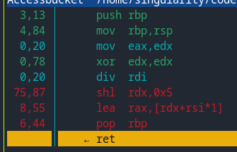

# Hash table

Это `README` посвящено такой структуре данных как `Hash table` и её оптимизации. 

## Hash table API

`hash_table.h`

```cpp
HashTableError HashTable_Ctor(HashTable* hash_table);
void HashTable_Dtor(HashTable* hash_table);

HashTableError HashTable_InsertByKey(HashTable* hash_table, 
                                     const StringView* key);
HashTableError HashTable_RemoveByKey(HashTable* hash_table, 
                                     const StringView* key);
Counter HashTable_LookUpByKey(const HashTable* hash_table,
                              const StringView* key);
```

```cpp
struct StringView {
    const char* str;
    size_t len;
};

```

## Выбор функции хеширования

Рассмотрим следующие hash функции:

|Значение хеша      |
|-------------------|
|всегда 0           |
|всегда первая буква|
|длинна слова       |
|сумма букв         |
|сумма букв / длину |
|rol                |
|murmur2            |

### График заселённости


### Дисперсия

| hash              | дисперсия |
|-------------------|-----------|
| always zero       | 104250    |
| always first char | 3746      |
| length            | 121412    |
| char sum          | 7469      | 
| normalized        | 101       |
| crc               | 881       |
| rol               | 15        |
| murmur            | 10        |

### Результат

Как мы видим `murmur hash` имеет наименьшую дисперсию так что будем использовать именно этот алгоритм.

### Реализация на C

```cpp
uint32_t HashMur(const uint8_t* ukey, size_t len) {
    uint32_t h = 0xbebeb0ba;
    uint32_t k = 0;

    for (size_t i = len >> 2; i; i--) {
        memcpy(&k, ukey, sizeof(uint32_t));

        ukey += sizeof(uint32_t);

        h ^= HashScramble(k);
        h = (h << 13) | (h >> 19);
        h = h * 5 + 0xe6546b64;
    }

    k = 0;
    for (size_t i = len & 3; i != 0; i--) {
        k <<= 8;
        k |= ukey[i - 1];
    }

    h ^= HashScramble(k);

    h ^= (uint32_t)len;
    h ^= h >> 16;
    h *= 0x85ebca6b;
    h ^= h >> 13;
    h *= 0xc2b2ae35;
    h ^= h >> 16;

    return h;
}

inline uint32_t HashScramble(uint32_t k) {
    k *= 0xcc9e2d51;
    k = (k << 15) | (k >> 17);
    k *= 0x1b873593;

    return k;
}
```

## Детали 

Будем проводить замер эффективности `LookUp` путем вставки каждого слова из текста в hash таблицу, после чего 30 раз сделаем `LookUp` каждого слова из текста.

|                    |                                               |
|--------------------|-----------------------------------------------|
| система            | **fedora 39 (linux kernel 6.8.5)**            |
| CPU                | **amd ryzen 5 3500u**                         |
| частота            | **1.4 GHz**                                   |
| температура        | **~80 C**                                     |
| компилятор         | **clang 17.0**                                |
| опции компилятора  | `-O2 -march=znver1 -flto`                     |
| load factor        | **~7**                                        |
| количество бакетов | **2003**                                      | 
| текст              | **Bible** (~788 000 слов, ~14 000 уникальных) |
| утиилиты           | **perf** и **hotspot**                        |

## Первоначальная эффективность

### main


### strcmp


### hash


### access bucket


|                | циклов затрачено | % от времени |
|----------------|------------------|--------------|
| `main`         | $4.392*10^{9}$   | $100$%       | 
| `strcmp`       | $1.575*10^{9}$   | $35.8$%      |
| `Hash`         | $0.705*10^{9}$   | $16.0$%      | 
| `AccessBucket` | $0.465*10^{9}$   | $10.6$%      |

## Оптимизация

Как мы видим основную часть времени занимает `strncmp`, `Hash` и `AccessBucket`

### strncmp

Слова в тексте не превышают 32 символов. Так же получая `const StringView*` мы копируем содержимое строки в буффер выровненный по 32. Всё это позволит использовать avx2 и выроненный load:

```cpp
#include <immintrin.h>

#define kWordMaxLen 32

int FasterStrcmp(const char word_key1[kWordMaxLen], 
                 const char word_key2[kWordMaxLen]) {
    __m256i load1 = _mm256_load_si256((const __m256i*)word_key1);
    __m256i load2 = _mm256_load_si256((const __m256i*)word_key2);
    __m256i xor_vec = _mm256_xor_si256(load1, load2);
                                       
    return !_mm256_testz_si256(xor_vec, xor_vec);
}
```

|                | циклов затрачено | % от времени |
|----------------|------------------|--------------|
| `main`         | $3.668*10^{9}$   | $100$%       | 
| `strcmp`       | $0.117*10^{9}$   | $3.2$%       |
| `Hash`         | $0.597*10^{9}$   | $16.0$%      | 
| `AccessBucket` | $0.401*10^{9}$   | $11.0$%      |

Время уменьшилось с $35.8$% до $3.2$%, что значительно.

### Hash

Взглянем на ассемблер который порождает **clang 17.0** для функции хеша:
```cpp
HashMur:                                # @HashMur
        mov     eax, -1094799174
        cmp     rsi, 4
        jb      .LBB0_4
        mov     rdx, rsi
        mov     rcx, rsi
        xor     r8d, r8d
        shr     rdx, 2
        and     rcx, -4
.LBB0_2:                                # =>This Inner Loop Header: Depth=1
        mov     r9d, dword ptr [rdi + 4*r8]
        inc     r8
        imul    r10d, r9d, -862048943
        imul    r9d, r9d, 380141568
        shr     r10d, 17
        or      r10d, r9d
        imul    r9d, r10d, 461845907
        xor     r9d, eax
        rorx    eax, r9d, 19
        lea     eax, [rax + 4*rax - 430675100]
        cmp     rdx, r8
        jne     .LBB0_2
        add     rdi, rcx
.LBB0_4:
        mov     rcx, rsi
        and     rcx, 3
        je      .LBB0_5
        xor     r8d, r8d
.LBB0_8:                                # =>This Inner Loop Header: Depth=1
        movzx   edx, byte ptr [rdi + rcx - 1]
        shl     r8d, 8
        or      edx, r8d
        dec     rcx
        mov     r8d, edx
        jne     .LBB0_8
        jmp     .LBB0_6
.LBB0_5:
        xor     edx, edx
.LBB0_6:
        imul    ecx, edx, -862048943
        imul    edx, edx, 380141568
        xor     eax, esi
        shr     ecx, 17
        or      ecx, edx
        imul    ecx, ecx, 461845907
        xor     eax, ecx
        mov     ecx, eax
        shr     ecx, 16
        xor     ecx, eax
        imul    eax, ecx, -2048144789
        mov     ecx, eax
        shr     ecx, 13
        xor     ecx, eax
        imul    ecx, ecx, -1028477387
        mov     eax, ecx
        shr     eax, 16
        xor     eax, ecx
        ret
```

Как мы видим основными операциями являются: 

1) Арифметические операции: `imul`, `xor`, `or`, `shl`, `shr`, `and`
2) Условные переходы: `jne`, `je`, `jb`
3) mov операторы: `mov`, `movzx`

"Медленными" среди них являются условные переходы и mov операторы с памятью

Уменьшить количество обоих не представляется возможным с практической точки зрения, поэтому попытка оптимизации функции хеша является неоправданной.

### AccessBucket

Функция выглядит следующим образом:

```cpp
LList* AccessBucket(const HashTable* hash_table, uint32_t hash_value) {
    return hash_table->buckets + (hash_value % hash_table->n_buckets);
}
```
Статистика **perf**:



Как мы видим ~$75$% времени функции занимает `div rdi`, полученная из `hash_value % hash_table->n_buckets`

Операция div является достаточно дорогой, **~41 cpu cycle**, в сравнении с более простыми арифметическими операциями, которые выполняются за **~1 cpu cycle**

В нашей реализации, размер хеш-таблицы фиксирован ( =2003 для данного текста ).
При фиксированном значение модуля мы можем представить его как комбинацию сложения, умножения и сдвигов. Для этого чаще всего используется техника называемая Barrett reduction.

Более того, компилятор обладает этой техникой и сам может оптимизировать `%`, но в данной реализации вторым операндом является поле структуры, которое хранит 2003 и так как поле n_buckets не является `const`, компилятор не может выполнить эту оптимизацию.

Заменим `hash_table->n_buckets` на константу:
```cpp
LList* AccessBucket(const HashTable* hash_table, uint32_t hash_value) {
    return hash_table->buckets + (hash_value % kNumberOfBuckets);
}
```

Результат:


|                | циклов затрачено | % от времени |
|----------------|------------------|--------------|
| `main`         | $4.067*10^{9}$   | $100$%       | 
| `strcmp`       | $1.454*10^{9}$   | $35.8$%      |
| `Hash`         | $0.770*10^{9}$   | $19.0$%      | 
| `AccessBucket` | $0.245*10^{9}$   | $6.0$%       |

Данная изменение уменьшило время функции `AccessBucket` с $11$% до $6$%

//FIXME barret reduction

## Результат всех оптимизаций

|                | циклов затрачено | % от времени |
|----------------|------------------|--------------|
| `main`         | $3.553*10^{9}$   | $100$%       | 
| `strcmp`       | $0.132*10^{9}$   | $3.7$%       |
| `Hash`         | $0.699*10^{9}$   | $19.6$%      | 
| `AccessBucket` | $0.207*10^{9}$   | $5.8$%       |

Отдельные замеры данных общего времени программы: с $3.859 * 10^9$ до $3.367 * 10^9$, ускорение на $13$%

## References

[MurMurHash2](https://ru.wikipedia.org/wiki/MurmurHash2)

[intel intrinsics guide](https://www.intel.com/content/www/us/en/docs/intrinsics-guide/index.html)

[Barrett reduction](https://en.wikipedia.org/wiki/Barrett_reduction)

## Contact me

naumov.vn@phystech.edu